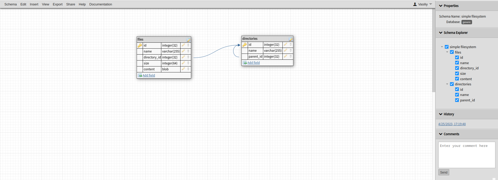

Created as a simple flask app with dummy API that allows to:

- add to db and view dummy data inside the project's 'sample_files' folder: http://127.0.0.1:5000/files/
- get file data from folder by file name: http://127.0.0.1:5000/sample_files/dummy.txt
- add new files inside 'instance' folder to db: http://127.0.0.1:5000/directory/instance
- changing the file's content inside a specific folder with new
  one: http://127.0.0.1:5000/change_file/sample_files/dummy.txt/New_file_content
- removing a file listed in specific folder from the database: http://127.0.0.1:5000/remove_file/sample_files/dummy.jpg

DB schema:

DB schema in mysql:
